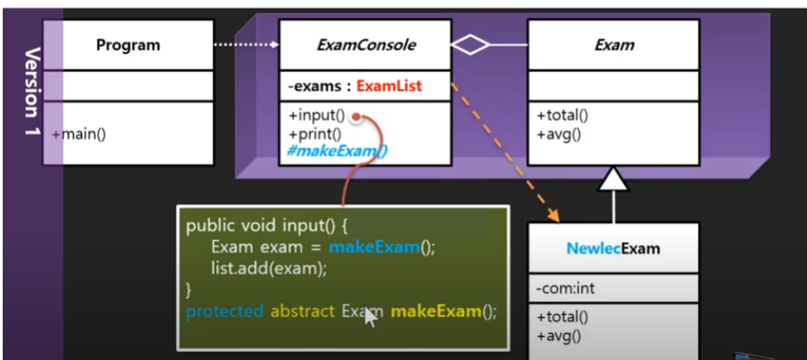
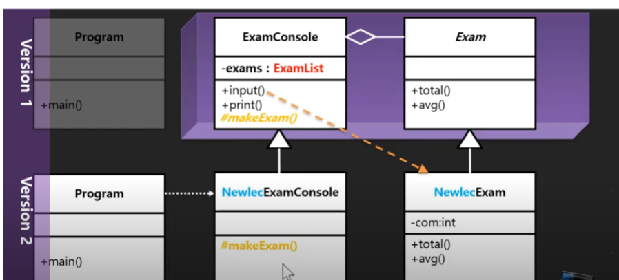
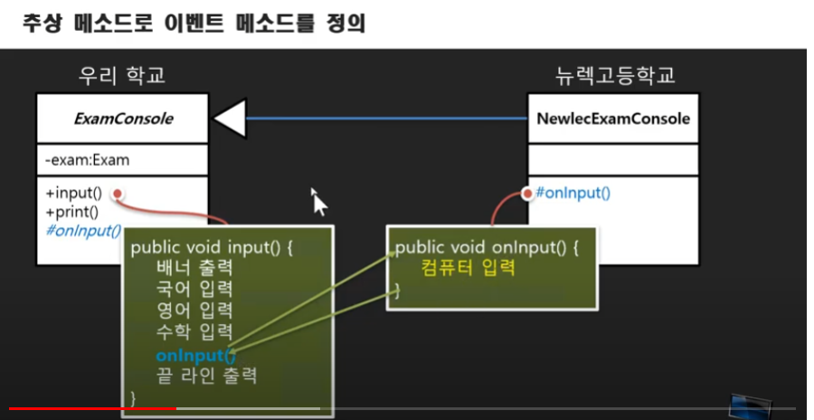
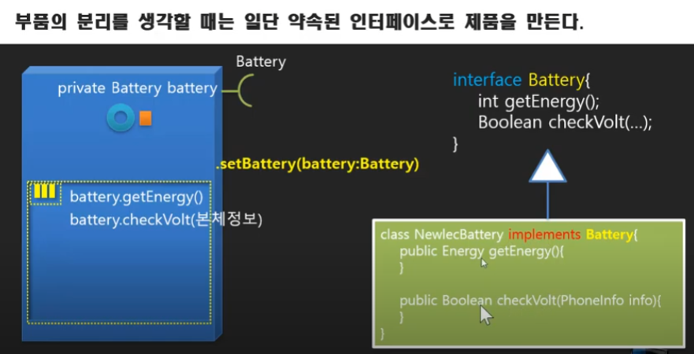
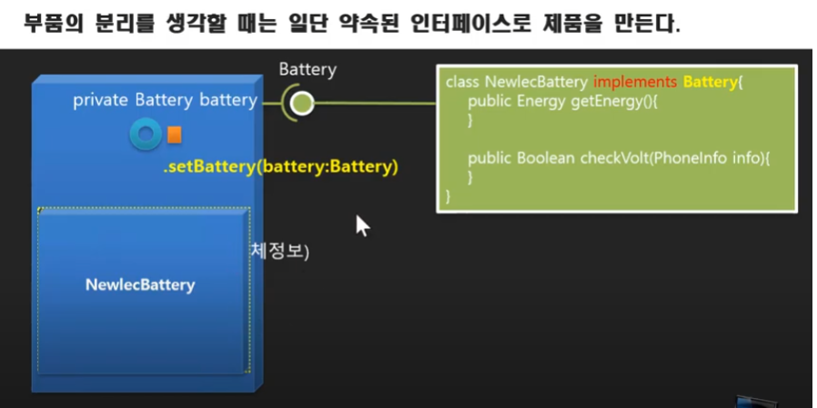
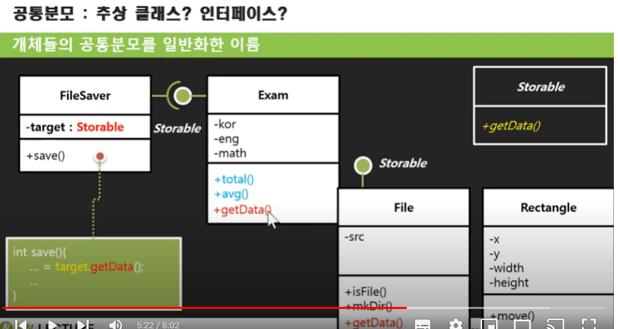
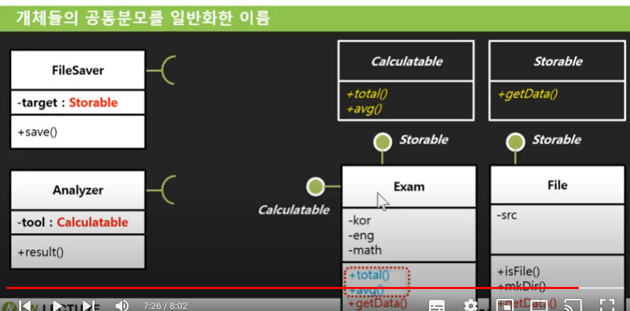
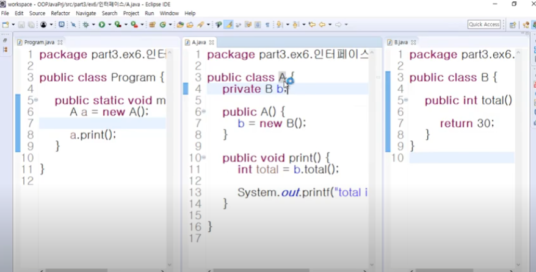
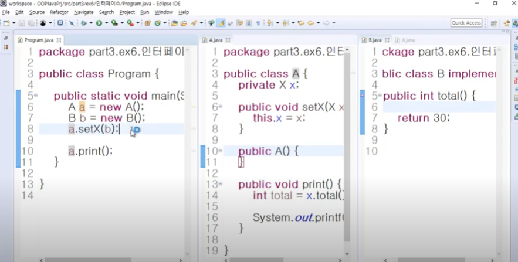
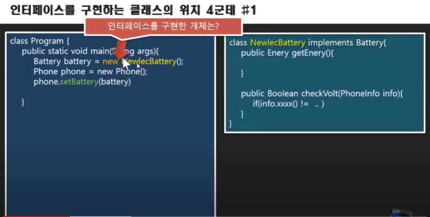

# 자바 객체지향 강의 25강 - 추상 메소드(Abstract Method) 구현하기
* 공통된 내용으로 구현하면 안되지만 공통된 서비스로 들어가야 하는 경우. Exam Class에서 total과 avg같은 경우 - 추상 메서드로 만듬
* 추상메서드는 구현은 자식에게 맡김 선언만 부모에서
* 추상메서드 선언부에 반환값 앞에 abstract키워드 넣기 - **자식이 무조건 구현해야 하는 함수가 된다.**/**부모(추상메서드선언부)에서는 정의하지 않는다.**
* protected 접근 제어자 : 자식에게만 공유됨 
* 기존에 부모의 메서드를 오버라이딩해서 사용할 때는 부모의 메서드를 호출하며 재사용하면서 편리했는데 추상화를 통해 메서드를 구현하면 부모 메서드엔 구현부가 없으므로 불편함 -> 부모 메서드에 protect 메서드로 이용할 수 있는 메서드를 구현해 자식에서 재사용하는 방식이 존재
* 추상메서드 : 공통자료형이라 할 수 있는 추상클래스가 갖고 있는 공통 서비스 함수다. 다만, 서비스해야한다는 것만 공통이고 구현은 개별인게 포인트

# 자바 객체지향 강의 26강 - 팩토리 메소드(Factory Method)(?)
* 팩토리 메서드 :  추상 메서드를 활용하는 대표적인 패턴
* 추상 메서드를 만든다는 것 -> 공통화 작업을 한다는 것
* 추상 클래스의 또 다른 의미 - 공통 자료형 - 부모 자료형으로 모든 자식 자료형들을 관리(배열 형태로)
* 소스 코드 수정없이 ExamConsole에서 new Exam();을 사용한 함수 input을 어떻게 바꿀 것인가.
* 팩토리 메서드 : 객체를 생성하는 부분을 자식에게 위임해서 자식이 객체 생성하는 부분을 책임지도록 하는 방식을 구현하는 메서드


* #MakeExam()을 팩토리 메서드라 한다.

# 자바 객체지향 강의 27강 - 팩토리 메소드 구현하기(?)
* 추상 메서드는 추상 클래스 안에서만 선언 가능하다.

# 자바 객체지향 강의 28강 - 이벤트 메소드 구현하기(?)
* 부모의 함수를 자식클래스에서 오버라이딩할 때 최대한 재사용 하는 법 - 이벤트 메소드?
* ExamConsole 의 input과 print를 NewlecConsole에서 구현할 때 Override해서 처음 부터 구현하는건 재사용하는 의미가 없다. 그럼? 기존 ExamConsole에서 국어 영어 수학 성적을 입력하는 부분에서 확장된 성적만 입력하는 부분을 꽂아넣을 수는 없을까?
* 해결법 : ExamConsole에 추상 메서드를 만듬 그 추상메서드를 ExamConsole의 input 안에 집어 넣고 구현은 NewlecConsole에서 하게 만든다.

* onInput함수를 이벤트 함수라고 부름. 왜? ~할 때 , 어떠 사건에 기반하여 실행되는 함수라고 해서. protect로 선언

# 자바 객체지향 강의 29강 - 코드 분리와 인터페이스
* 추상화라는 것은 집중화를 의미한다.
* 인터페이스는 분리에 관련돼 있다.
* 두 가지 형태의 인터페이스가 있다.
* 직접 사용할 수 없는(분리돼 있는) 무언가에 접근하게 해주는 도구 - 인터페이스
*  휴대폰의 경우 배터리를 분리해서 각자 다양하게 만들되 약속된 인터페이스로 제품을 만든다.
*  인터페이스는 분리돼 있는 객체를 사용하게 해주는 약속



# 자바 객체지향 강의 30강 - 추상클래스와 인터페이스의 차이
* 추상 클래스 : 개체들의 공통분모를 일반화한 이름 
* 추상 클래스는 먼저 존재 후 사용하는 입장에서 어떤 클래스를 사용할지 결정 인터페이스는 반대
*  서비스가 먼저 존재 후 인터페이스만 놓고 구현은 알아서 맡김 구현 공통되지 않은 여러 객체들이 하나의 인터페이스를 구현하는게 가능. 서비스를 중심으로 


* 인터페이스는 사교적인 관계를 만들어내는 상속이라면 클래스 상속(추상클래스?)는 DNA를 물려받는 것이다.

# 자바 객체지향 강의 31강 - 객체 단위로 분리/결합을 위한 인터페이스 구현하기(?)
* 인터페이스의 4종류
   1. 코드 분리를 염두에 두지 않은 결합력이 강한 코드
   2. 캡슐 단위 인터페이스    
   3. 일부 기능
   4. 구현코드의 일부
* **결합이 강하게 돼있다.** = 소스코드 수정을 통해서만 고칠 수 있는게 결합력이 강하다는 것 소스코드 없이 바꿀 수 있는 것이 결합력이 낮은 것

# 자바 객체지향 강의 32강 - 개체 결합을 위한 인터페이스 구현하기
* 나중에 의존성을 주입할 수 있게 하기-> 결합력을 떨어드림
* 결합력이 강한코드

나중에 의존성 주입하게 변경

* 사용자는 (Program) B라는 코드를 볼 수 없음. B라는 녀석을 바꾸려면 A 전체를 바꿔야함
* Interface가 필요한 경우 B가 없어야함. -> 현재는 A가 쓸 수 있는 객체가 없고 앞으로 태어날 녀석을 참조할 자료형=인터페이스 필요
* Interface는 어떤 기능에 대한 목록을 약속하는 것이기 때문에 데이터를 서비스하거나 하는 캡슐이 아니라 접근제어자가 필요가 없고 어떠한 속성(멤버 변수)도 정의하지 않음
* Interface에서 약속하고 있는 메서드를 구현한 객체라면 무조건 그 녀석만 참조 해주는 것.
* 클래스 A에서 X를 new(객체 생성)하고 있는 것은 없음 -> 객체 생성은 사용자(Program)의 몫
* X interface를 구현한 어떤 객체도 setX를 통해 연결 가능

# 자바 객체지향 강의 33강 - 새로운 객체로 바꾸기(문자열을 읽어서 객체로 만들기)(?)
* 소스 코드 변경 없이 새로운 객체로 변경하기 ->설정파일에서 어떤 클래스 사용할지 정하기
* 설정파일종류 1. xml,json파일 2. annotation
* Class.forName("클래스명(패키지명포함)"); : 클래스 이름으로 클래스 정보를 얻는 클래스 구조체
* 인스턴스명.getClass()  = 클래스명.class = Class.forName("클래스명(패키지명포함)") : 해당 클래스의 매개변수, 메서드 , 생성자, 어노테이션 등의 정보를 알 수 있다.
* 클래스정보 활용 : Class clazz = Class.forName("part3.ex6.인터페이스.B");   X x = clazz.newInstance();
* clazz.newInstance(); = new 클래스명; ->jdk 버전마다 다르고 이 경우는 jdk1.8버전
* 인스턴스 만드는 법 2가지
    1. new 클래스명();
    2. 클래스명.class.newInstance();
* Dependy Injection 예제
   * Program.java(main 함수)
   ```
   package part3.ex6.인터페이스;

import java.io.FileInputStream;
import java.io.IOException;
import java.util.Scanner;

public class Program {

	public static void main(String[] args) throws IOException, ClassNotFoundException, InstantiationException, IllegalAccessException {
		FileInputStream fis = new FileInputStream("src/part3/ex6/인터페이스/setting.txt");
		Scanner scan = new Scanner(fis);
		String className = scan.nextLine();
		scan.close();
		fis.close();
		
		Class clazz = Class.forName(className);
		A a = new A();
		X x = (X) clazz.newInstance();
		a.setX(x);
		a.print();
	}

}

   ```
   * A.java(인터페이스 X에 의존하는 클래스)
   ```
   package part3.ex6.인터페이스;

public class A {
	private X x;
	
	
	
	public void setX(X x) {
		this.x = x;
	}

	public A() {
//		b= new B();
	}
	
	public void print() {
		int total = x.total();
		
		System.out.printf("total is %d\n", total);
	}
	
	
}

   ```
   * X.java(interface)
   ```
   package part3.ex6.인터페이스;

public interface X {
	int total();
}

   ```
   * B.java(interface X계승한 클래스)
   ```
   package part3.ex6.인터페이스;

public class B implements X {

	public int total() {
		
		return 30;
	}

}

   ```
   * C.java(interface X계승한 클래스)
   ```
   package part3.ex6.인터페이스;

public class C implements X{

	@Override
	public int total() {
		return 50;
	}

}

   ```
# 자바 객체지향 강의 34강 - 일부 기능을 분리하는 인터페이스(?)
* 같은 계열의 객체를 바꿔 낄 땐 추상 클래스, 구조가 완전히 다르고 족보가 다른 객체를 바꿔 낄 땐 인터페이스
* 전체 객체가 아닌 일부 기능(메서드)을 바꿔 끼는 경우의 인터페이스  
* 객체의 메서드의 인자로 어떤 인터페이스를 구체화한 객체를 받을 때 이런 식으로 구현

# 자바 객체지향 강의 35강 - 인터페이스를 구현하는 위치는?
* 구현하는 위치가 새로운 클래스를 이용해서 구현했었는데 그게 올바른 방법인지 아니라면 어떤 방법을 써야하는지

* 새로만들 객체가 부품이 될 때 부픔으로서 역할을 할 때 새 클래스 만듬\
* GameFrame 예제에서 GameWindowListner 개체를 새로 만드는게 아니라 GameFrame 자체에서 인터페이스 구현

# 자바 예외처리 01강 - 예외처리에서 예외란 무엇을 말하는가?
