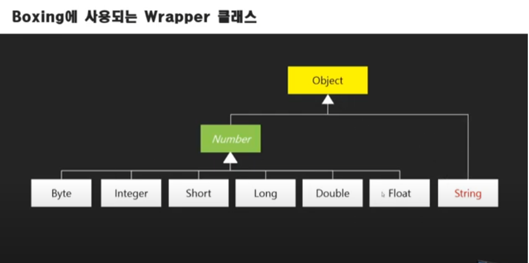
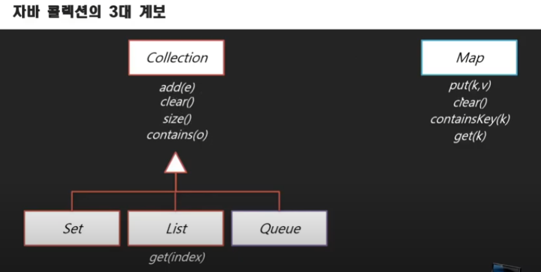
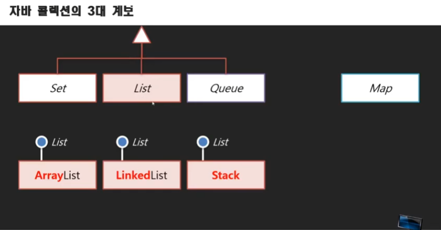

# 자바 예외처리 01강 - 예외처리에서 예외란 무엇을 말하는가?
* 오류
   * 구문오류 : 가장 치명적이지 않음(문법 오류- 컴파일러가 발견해주기 때문)
   * 논리오류 : 치명적임, 구문오류는 없고 논리 오류로 인해 원했던 결과와 다를 경우
   * 예외     : 입력 값에 대한 오류. 누군가만, 어떤 컴퓨터만, 어떤 상황에서만 예외 적으로 발생하는 오류 (Ex. 물리적인 장치문제에 의해 값 입력에 대한 오류)

# 자바 예외처리 02강 - 예외를 처리한다는 것은 무엇을 말하는 것이고 어디에서 예외를 처리해야 하는가?
* 오류처리의 주체 : 예외가 발생했을 경우 그것을 어떻게 처리할 것인지 책임자(api사용하는 부분)에서 처리, api 부분에선 throws 보고
* throws 를 통해 예외처리를 넘김 자바에선 예외 객체를 전달.
* 예외를 받아서 처리하는 부분에선 try()catch(){}문 사용

# 자바 예외처리 03강 - 예외를 던지는 클래스 준비하기

# 자바 예외처리 04강 - 예외 클래스 생성과 던지기(throw)
```
Public static int add(int x, int y) throws 천을_넘는_예외, 음수가되는예외// 외부의 자신을 호출하는 곳에서 처리(try,catch)하도록 넘김 여러개 가능
{

  int result = x + y;
  if(result > 1000)
    throw new 천을_넘는_예외(); // 예외를 자기 자신한테 던짐. 자기(메서드) 안의 try, catch로
  
  if(result < 0)
    throw new 음수가되는예외();
  
  return x+y;
}
```

# 자바 예외처리 05강 - 예외를 받고 처리하기
* 예외 처리의 2가지 의미
   1. 사용자에게 오류 알리기
   2. 치명적인지에 따라서 그대로 이어갈지 결정할 수 있게 해줌  
* eclipse와 같은 ide를 쓰는 경우를 제외하면 API의 specification을 보고 어떤 예외가 있는지 파악해야한다.
* try부분에서 예외가 발생될 수 있는 함수호출부분을 두고 catch부분에 예외가 발생할 경우의 코드를 작성한다.

# 자바 예외처리 06강 - 다중 예외처리
* 특정 영역에서 여러개의 예외가 던져질 경우 여러개의 catch로 잡음, 일괄적으로 처리해야 할 경우는 하나의 catch에서 처리
* catch문은 순차적으로 처리되기 때문에 가장 구체적인 것을 위에 둬야 한다.(모든 예외를 처리할 수 있는 Exception객체가 가장 마지막)
* finally는 예외가 있든 없든 무조건 실행

# 자바 예외처리 07강 - UnChecked 예외
* checked예외 - 꼭 잡아야 하는 예외, unchecked예외 - 안잡아도 되는 예외
* 나눌 때 분모가 0이면 예외 발생 - 이 예외가 unchecked예외
* unchecked 예외 = runtimeException  -> unchecked예외로 만들 예외객체는 Exception클래스가 아닌 RuntimeException클래스 상속받아야함
* unchecked예외로 만들면 try/catch 로 무조건 잡아야 되는 것은 아님. 선택 할 수 있다.

# 자바 컬렉션과 제네릭 강의 01 - 학습 개요
* 콜렉션 : 배열갖고 직접사용하는 것들을 서비스 개념으로 사용할 수 있게 해주는 도구, 데이터를 수집하고 관리해주는 객체\
* 콜렉션은 가변길이 배열이라고도 할 수 있다.

# 자바 컬렉션과 제네릭 강의 02 - 정수형 콜렉션 구현하기
```
package com.newlecture.app.util;

public class IntList {
	
	private int[] nums;
	private int current; //우연찮게 사용자가 입력한 값의 개수와 일치하게 됨
	
	public IntList() {
		nums = new int[3];
		current =0;
	}

	public void add(int num) {
		nums[current] = num;
		current++;
	}

	public void claer() {
		current =0;
	}

	public int size() {
		return current;
	}

	public int get(int index) {
		if(current <= index)
			throw new IndexOutOfBoundsException();
			
		return nums[index];
	}

}
```

# 자바 컬렉션과 제네릭 강의 03 - Object 클래스의 필요성
* 모든 데이터를 목록으로 관리할 수 있는 자료형식이 있나요? ->Object클래스
* 모든 클래스는 Object이다. 최상위 클래스. 범용자료형
* 참조변수는 Object로 관리하면 되지만 기본자료형은 값인데 어떻게 하나의 자료형으로 관리할 수 있는가? ->Wrapper 클래스로 해결

# 자바 컬렉션과 제네릭 강의 04 - Wrapper 클래스와 Auto Boxing/UnBoxing
* Object obj =3; -> 불가능.
* 정수형을 참조형으로 만들어주는 Integer클래스
* Boxing : 기본자료형을 그것을 담을 클래스에 넣는 작업 -  Ex. 3-> new Integer(3); 직접한 것
* AutoBoxing : Object obj = 3;을 해도 위의 과정이 일어나는 것
* UnBoxing : int x = obj.intValue(); ->이것도 자동으로 됨(AutoUnBoxing)
* Boxing에 사용되는 Wrapper 클래스의 종류

* Auto Boxing/UnBoxing을 통해서 참조변수 뿐 아니라 Primitive 형식도 Object에 담을 수 있게 됨.
* 데이터 타입 종류
   * 원시 타입(primitive type)은 쉽게 말해, 정수, 실수, 문자, 논리 리터럴등의 실제 데이터 값을 저장하는 타입이고,
   * 참조 타입(reference type)은 객체(Object)의 번지를 참조(주소를 저장)하는 타입으로 메모리 번지 값을 통해 객체를 참조하는 타입이다. 
* int x =3; Integer x = 3; 은 자동으로 박싱이 일어난 것이지 같은것이 아님에 주의.
* 만약 Integer x =3; 이고  add(x,4);일 경우 참조를 전달한 것이 아니라 자동으로 UnBoxing이 일어난것

# 자바 컬렉션과 제네릭 강의 05 - Object 콜렉션으로 변경하기
```
package com.newlecture.app.util;

public class ObjectList {
	
	private Object[] nums;
	private int current; //우연찮게 사용자가 입력한 값의 개수와 일치하게 됨
	
	public ObjectList() {
		nums = new Object[3];
		current =0;
	}

	public void add(Object num) {
		nums[current] = num;
		current++;
	}

	public void claer() {
		current =0;
	}

	public int size() {
		return current;
	}

	public Object get(int index) {
		if(current <= index)
			throw new IndexOutOfBoundsException();
			
		return nums[index];
	}

}
```
* Object를 범용자료형으로 쓸 때 문제점
   1. 어느 값을 가지는지 확신을 못함
   2. 명시적 형변환을 거치고 사용해야 함 

# 자바 컬렉션과 제네릭 강의 06 - Generic 이란
* 제네릭 : 제네릭은 클래스나 메소드에서 사용할 내부 데이터 타입을 컴파일 시에 미리 지정하는 방법
```
package com.newlecture.app.util;

public class Program {
	public static void main(String[] args) {
		GList<Integer> list = new GList<>();
		list.add(3);
		list.add(5);
		int size = list.size();
		System.out.printf("size : %d\n", size);
		list.claer();
		size = list.size();
		System.out.printf("size : %d\n", size);
		list.add(7);
		int num = list.get(0); // Object ->Integer
		System.out.printf("num : %d\n", num);
//		num = (Integer)list.get(1);
	}
}
```
```
package com.newlecture.app.util;

public class GList<T> {
	
	private Object[] nums;
	private int current; //우연찮게 사용자가 입력한 값의 개수와 일치하게 됨
	
	public GList() {
		nums = new Object[3];
		current =0;
	}

	public void add(T num) {
		nums[current] = num;
		current++;
	}

	public void claer() {
		current =0;
	}

	public int size() {
		return current;
	}

	public T get(int index) {
		if(current <= index)
			throw new IndexOutOfBoundsException();
			
		return (T)nums[index];
	}

}
```

# 자바 컬렉션과 제네릭 강의 07 - 연습문제 : 가변크기 컬렉션으로 변경하기
* 공간 늘려주는 알고리즘
   1. amount개 확장한 새로운 배열 temp를 생성한다.
   2. list에 있는 데이터를 temp 배열로 옮긴다.
   3. temp가 참조하는 객체를 list가 참조하게 한다.
   4. 현재 capacity의 값을 amount만큼 증가시킨다. 

# 자바 컬렉션과 제네릭 강의 08 - 풀이 : 가변크기 컬렉션으로 변경하기
* eclipse 변수명 일괄 수정법
   * 마우스로 하기
      1. 바꾸고자 하는 변수 클릭
      2. 마우스 오른쪽 클릭 -> Refactor -> Rename
      3. 단어변경
   * 키보드로하기
      1. 바꾸고자 하는 변수 클릭
      2. Alt+Shift+r
      3. 단어변경

* 가변크기변경이 적용된 최종 컬렉션!
```
package com.newlecture.app.util;

public class GList<T> {
	
	private Object[] list;
	private int current; //우연찮게 사용자가 입력한 값의 개수와 일치하게 됨
	private int capacity;// 용량
	private int amount;// 추가 증가량
	
	public GList() {
		capacity = 3;
		amount = 5;
		list = new Object[3];
		current =0;
	}

	public void add(T num) {
		if(capacity <=current) {
			Object[] temp = new Object[capacity+amount];
			for(int i=0;i<current;i++)
				temp[i]=list[i];
			list=temp;
			capacity+=amount;
		}
		
		list[current] = num;
		current++;
	}

	public void claer() {
		current =0;
	}

	public int size() {
		return current;
	}

	public T get(int index) {
		if(current <= index)
			throw new IndexOutOfBoundsException();
			
		return (T)list[index];
	}

}
```

# 자바 컬렉션과 제네릭 강의 09 - 자바 언어에 포함된 콜렉션 프레임워크
* 자바 콜렉션의 3대 계보(Interface)

* 3대 컬렉션(자주사용) : Set, List, Map
* List 콜렉션들의 실제 구현체

* 보통 ArrayList사용
* Map 콜렉션 실제 구현체 - HashedMap
* List 구현체간의 차이? 
   * ArrayList 선형 데이터구조 - 값들이 연결돼 있음. 맨뒤에 있는 값은 스캔 시간이 오래 걸리는 단점 존재 (풀스캔방식)
   * 비선형 데이터구조(Tree 모양) - 삽입은 오래걸리고 읽는건 스캔 속도 빠름   
   * 선형 데이터구조 중 링크(참조, 포인터)로 연결된 데이터 - 데이터 삭제가 자유로움, 기존 배열은 값다 앞으로 당겨와야함
* 공부는 큰 줄기부터 
* List 대표적 구현클래스 ArrayList, Set 대표적 구현클래스 HashSet, Map 대표적 구현클래스 HashMap

# (최종)자바 컬렉션과 제네릭 강의 10 - Set/List/Map 콜렉션
* 우리가 구현했던  GList는 ArrayList와 비슷
* list와 set의 차이 : 넣었던 값을 꺼낼 식별자가 없다. 값이 곧 식별자. 그리고 Set은 값이 중복될 수 없음 Set = 집합
* Set은 보통 중복 제거용으로 사용한다.
* Map은  Key와 Value 한 쌍으로 데이터를 관리
