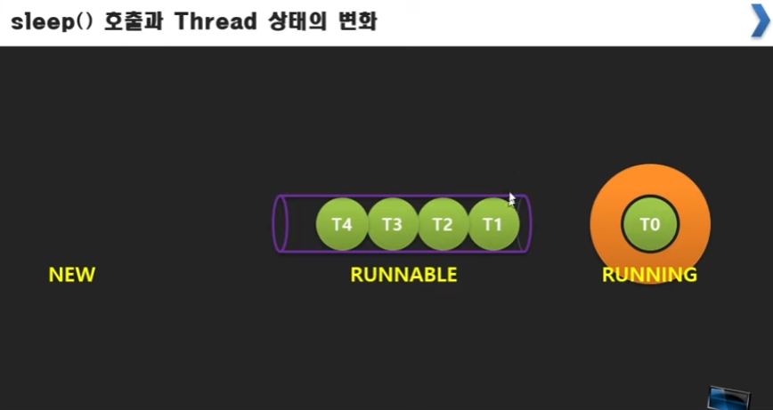

# 자바 스레드 1부 1강 - 학습안내
* 학습 내용 - 스레드 개념, 스레드 관리, 동기화, 동기화 도구, 스레드 풀, 스레드에 안전한 콜렉션, 포크/조인

# 자바 스레드 1부 2강- Process, Context Switching
* OS : 사용자 요청을 받으면 그 프로그램을 찾아서 실행해줌, OS자체는 메모리가 아닌 하드디스크와 같은 보조기억장치에 존재
* 프로세스 : 메모리에 올라가 동작 중인 프로그램
* 여러 개의 프로세스가 동시에 동작할까?
* 멀티태스킹/멀티프로세스 : CPU가 동시에 실행시키는건 아니지만 동시에 실행시키는것처럼 실행. 빠른 순회 - OS가 시분할(Time Share)을 통한 동시 실행을 지원
* Context 스위칭 : cpu가 여러 프로세스를 시분할로 처리할 때 완료되지 않을 경우 그 프로세스의 상태를 context 객체에 저장하면서 실행하는 것.

# 자바 스레드1부 3강-동기/비동기식 실행, 자식 프로세스, 욕심꾸러기 프로세스
* 동기식 실행 : 이전의 처리가 끝나야 다음 처리가 이루어 지는 것
* 스레드 이전에는 OS시분할 기능을 이용해서 비동기로 처리하고 싶은 기능의 경우 아예 프로그램단위로 호출해서 사용.(자식 프로세스)
* 자식 프로세스 방식의 문제 -> 스레드가 나오면서 해결 
   * 컨텍스트 스위칭에 대한 부담,스위칭자체도 시간이 소요돼서 비효율적
   * 자식 프로세스가 많은 프로세스만 자원 독차지하는 문제
   * 자식프로세스라고 해도 프로세스간에는 데이터 공유가 안됨

# 자바 스레드1부 4강-프로세스에서 스레드 문맥 스위칭으로
* 스레드 : 한 프로세스 안에서 시간을 분할해서 쓰는 단위, 한 프로세스에 60ms가 배당되면 스레드가 두개 있을 경우 20ms씩 받음
* 한 프로세스 안에서 흐름을 나눠갖기 때문에 코드 흐름에 대한 포인터와 코드가 진행되는데 필요한 지역변수들을 저장하는 스택영역만 스위칭이 되면 됨  데이터와 힙 영역은 공유, 두 부분만 스위칭하면 되기 때문에 스위칭하는 시간도 프로세스 스위칭보다 짧음
* 스레드를 이용한다는 것은 문맥(Context)이 여러개라는 것
* 메모리 영역에 정리 : https://box0830.tistory.com/150

# 자바 스레드1부 5강-멀티 스레드를 위한 예제 준비하기
* 별도의 흐름을 만들어내는 Thread클래스
* 스레드 객체 사용법


* 자바에서 익명 함수는 익명 클래스이다. 또한 자바에서 람다함수는 익명 함수가 아닌 익명 클래스이며 Object를 부모로 갖는 클래스이다
```
? obj = new Object()//익명 클래스의 부모 클래스!{
        	int max(int a, int b) { //클래스 내의 멤버변수나 메서드 구현.
            	return a>b ? a:b;
            }
        };
```

# 자바 스레드1부 7강-스레드를 식별하는 이유와 그것을 위한 속성
* 동일한 로직이라면 스레드 객체만 달리하고 Runnable의 내용은 같게 하면 된다.
* 여러 스레드에서 동일한 코드를 실행할 때 지금 실행하는게 어떤 스레드인지 식별하는 속성 필요.  
   * id : 스레드의 식별 값, 자동으로 부여
   * name : 스레드의 이름, 설정 가능
   * priority : 스레드의 우선순위(범위 : MIN(0) ~ MAX(10)), 숫자가 클 수록 우선 순위가 높음
   * status : 스레드의 상태 - new, runnable, blocked, waiting ,time waiting, terminated
```
package part1;

public class Ex3Program {

	public static void main(String[] args) {
		
		Runnable subMain = new Runnable() {//쓰레드용 인터페이스 runnable을 부모로 갖는 익명 클래스의 객체 생성
			@Override
			public void run() {
				print();
			}
		};
		
		
		Thread th1 = new Thread(subMain);
		th1.setName("sub1");//스레드 이름 설정
		Thread th2 = new Thread(subMain);
		th2.setName("sub2");
		
		
		
		th1.start();//스레드 시작하기
		th2.start();
		
		Thread th = Thread.currentThread();//main thread 불러오는것
		th.setName("Main"); //
		print();
	}

	private static void print() {
		
		Thread th = Thread.currentThread();// thread정보 불러오기
		
		for(int i=0;i<100;i++) {
			
			try {
				Thread.sleep(20);
			} catch (InterruptedException e) {
				// TODO Auto-generated catch block
				e.printStackTrace();
			}
			
			if(th.getName().equals("Main"))
				System.out.printf("<%s[%d] : %d\n", th.getName(), th.getId(), i+1);
			
			System.out.printf("%s[%d] : %d\n", th.getName(), th.getId(), i+1);
		}
	}


}
```

# 자바 스레드1부 8강- TIMED_WAITING 스레드 상태
* 스레드의 상태 - new, runnable, blocked, waiting ,time waiting, terminated
* 스레드의 상태에 영향을 주는 함수 - Thread클래스의 sleep함수
* sleep() 호출과 Thread 상태의 변화

* New 엔 생성된 Thread객체가, 객체에 start 함수를 호출하면 Runnable상태(버퍼)로, 시분할로 Running상태로 정해진 시간동안 하나씩 실행됨
* sleep()이 호출되면 그 시간만큼 TIMED_WAITING버퍼에 들어가있음->시간 끝나면 RUNNAble로

# 자바 스레드1부 9강- 보조스레드 종료문제와 waiting상태
* 메인은 끝났지만 서브 스레드가 끝나지 않은 경우는 어떻게 될까? 프로세스가 끝나지 않음. th.join()을 통해 기다림.
* th1.isAlive(); 보조 스레드가 작동중인지 확인하는 메서드
* Waitin상태 - 메인은 끝났지만 서브 스레드가 끝나지 않은 경우 join함수를 메인에서 쓰면(서브스레드의 객체로 함수호출해야함) 메인이 Waiting상태가 됨

# 자바 스레드1부 10강-스레드 종료방법 interrupt()
* 보조 스레드 종료시키는 interrupt함수 - 메인에서 정할 수 있는게 아니고 서브 스레드에 요청하는것, 서브 스레드에서 th.isInterrupted()로 받아줘야함
* 하지만 sleep함수를 길게 한다면 interrupt하는 의미가 없음 ->  sleep의 try, catch블록에서 catch부분에서 return을 해야함
* main에서 하위스레드가 끝나는걸 join으로 기다릴 순 있다. 무한정 기다릴 수 없어서 하위 스레드를 끝내고 싶으면 interrupt를 하는데 청유형이기 때문에 하위스레드에서 받아서 스스로가 interrupt된지 확인하고 return을 해줘야 한다. .sleep을 하는 경우도 time_wating의 상태지만 interrupt당하면 바로 깨어나서 예외처리가 진행되는데 여기에서 return을 해줘야 스레드가 종료된다. 

# 자바 스레드1부 11강-스레드 우선순위와 데몬스레드
* setPriority함수를 통해 우선 순위 정함
* Daemon : 보조적인 스레드로서 다른 스레드들이 끝나면 이것도 끝남, 보통 우선 순위도 가장 낮게 설정함. 실행하던 도중이라도 끝냄
* 데몬스레드는 업무적인 로직을 가지면 안된다. 보조하는 로직을 담아야 한다.
* 대표적인 데몬 스레드로서 가비지 컬렉터가 있다.

# 자바 스레드1부 12강-스레드 그룹 이용하기
* 여러 스레드를 일일히 interrupt하긴 힘들어서 스레드 그룹 존재
