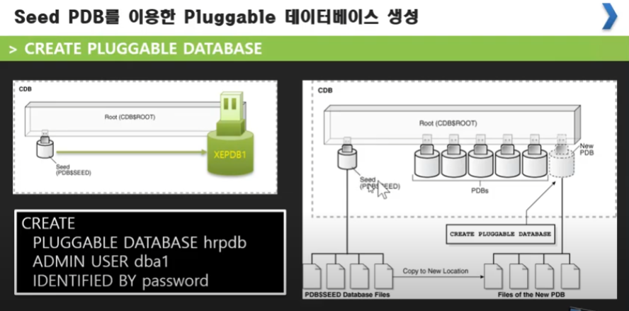

# 오라클 데이터베이스 SQL 강의 1강 - 학습안내(SQL, DB, DBMS의 의미와 필요성)
* sql(Structured Query Language) : DBMS에게 구조적으로 질의하는 명령어, 
* DBMS : Database + Management System
* 기존에 로컬에서 파일시스템으로 데이터 관리 -> 물리적으로 떨어진 PC에선 실시간 처리가 안됨 ->데이터를 각자 가지는 것보다 한곳에서 관리(Database) - 데이터 중복이 사라짐 
* 중복을 없애기 위해 테이블을 쪼개며 참조하는 방법이 필요.
* 테이블 끼리 참조하는 방법
   * Hierarchicla DBMS(계층형)
   * Nework DBMS
   * Object-Oriented DBMS
   * Relational DBMS(관계형) : 지금 우리가 사용하는 방식 
* 동시성(여러 PC가 한 데이터에 접근할 때 동시성 처리의 문제). 성능, 보안을 책임져주는 관리자가 필요. -DBMS

# 오라클 데이터베이스 SQL 강의 2강 - 오라클 DBMS 18c XE 설치하기
* oracle.com/downloads -> express edition(개발용)이 무료이므로 다운로드.
* oracle db설치는 사용자명, 설치파일명이 영어여야한다.
* oracle db는 server프로그램으로 client프로그램이 따로 필요하다.(sqlplus/sql developer)

# 오라클 데이터베이스 SQL 강의 3강 - SQL Developer 설치하기
* sqlplus cmd창 접속 명령어 : sqlplus sys as sysdba
# 오라클 데이터베이스 SQL 강의 4강 - 오라클 PDB 서버에 접속하기
* pluggable 데이터베이스 : 가상컴퓨터라고 생각하면 된다. root database(Container DB)에서 seed database(template)를 바탕으로 생성된 database안의 작은 database.

* pdb로 접속하려면 sql developer에서 sid가 아닌 서비스이름에 pdb이름 적고 접속
* cdb와 pdb는 계정도 전부 별도
* 원격 접속을 위한 설정 변경 : EXEC DBMS_XDB.SETLISTENERLOCALACCESS(FALSE); ->local에서만 접속가능한것을 false로 - cdb 에서 실행해야 한다. -> client에서 db  server의 ip입력 후 접속, 방화벽 1521 포트 열어놔야함

# 오라클 데이터베이스 SQL 강의 5강 - 수업용 사용자와 데이터베이스 생성하기
* 개념적 데이터 = entity, 개체 ->dbms에선 table로 표현
* db는 데이터를 여러 파일에 모아놓는다.(물리적으로)
* 테이블 스페이스 : 테이블들을 모아놓는 공간
* 스키마 : 데이터베이스는 테이블, 인덱스 등의 오브젝트 등으로 구성돼 있는데 이런 오브젝트들로 이뤄져있는 구조를 스키마라고 한다.
* 테이블 스페이스 만드는법
   1. db선택
   2. 보기메뉴 클릭
   3. dba클릭
   4. dba목록에 +버튼 클릭
   5. pdb서버 클릭
   6. + 누르고 저장영역 클릭
   7. 테이블스페이스 오른쪽 클릭하고 새로만들기
   8. 이름, 디렉토리, 파일크기 설정하기
   9. 하나는 임시 테이블스페이스 만들기(log)
