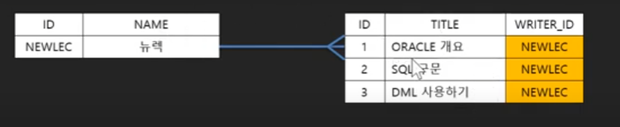
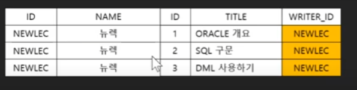
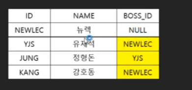
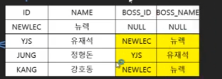

# 오라클 데이터베이스 SQL 강의 24강 - 문자열 내장 함수 #2
* 함수는 중첩이 가능
* 문자열 함수(이어서)
   * 문자열 패딩 함수 - 글자수를 정해서 무조건 그 글자수로 반환, 빈 공간을 어떻게 채우는지는 옵션
      * SELECT LPAD('HELLO', 5) FROM DUAL;    - HELLO  남는공간 없어서 그대로 출력
      * SELECT LPAD('HELLO', 5, '0') FROM DUAL;  - HELLO 
      * SELECT LPAD('HELLO',10,'0') FROM DUAL;   - 왼쪽에 0으로 채움 00000HELLO
      * SELECT RPAD('HELLO',10,'0') FROM DUAL;    - 오른쪽에 0으로 채움 HELLO0000
   *  첫 글자 대문자로 바꾸는 함수 INITCAP
   *  문자열 검색 함수 INSTR(문자열, 검색문자열, 위치, 찾을 수)
   *  문자열 길이를 얻는 함수 LENGTH
   *  코드 값을 반환하는 함수 ASCII('A')
   *  코드 값으로 문자를 반환하는 함수 CHR(65)

# 오라클 데이터베이스 SQL 강의 25강 - 숫자 내장 함수(ABS/SIGN/ROUND/TRUNC/CEIL/FLOOR)
* 숫자 함수
   * 절대값을 구하는 함수 ABS(n) -> 수 절대값 반환
   * 음수/양수를 알려주는 함수 SIGN(n) ->  0은 0 양수는 1 음수는 -1 반환
   * 숫자의 반올림 값을 알려주는 함수 ROUND(n,i) - > i소수자리까지 반올림
   * 숫자의 나머지 값을 반환하는 함수 MOD(n1, n2)
   * 숫자의 제곱을 구하는 함수와 제곱근을 구하는 함수 POWER(n1,n2) / SQRT(n)

# 오라클 데이터베이스 SQL 강의 26강 - 날짜 함수(SYSDATE/CURRENT_DATE/SYSTIMESTAMP/CURRENT_...)
* 날짜 함수
   * 현재 시간을 얻는 함수 - SYSDATE, CURRENT_DATE, SYSTIMESTAMP, CURRENT_TIMESTAMP -파라미터 없는 함수
      * SYS->오라클 시스템 시간, CURRENT ->세션 설정 시간,  DATE-년월일까지, TIMESTAMP - 시분초까지 
   * 세션 시간과 포맷 변경 - 우리나라는 그리니치 시간으로붙처 9:00 + 되는 타임존을 가지며 우리나라는 하나의 타임존만을 지닌다.
      * ALTER SESSION SET TIME_ZONE = '-1:0';
      * ALTER SESSION SET NLS_DATE_FORMAT = 'YYYY-MM-DD HH24:MI:SS';  - NLS(National Language Support) 
   * 날짜 추출함수 EXTRACT(YEAR/MONTH/DAY/HOUR/MINUTE/SECOND)
   * 날짜를 누적하는 함수 ADD_MONTH(날짜, 정수) 
   * 날짜의 차이를 알아내는 함수 MONTHS_BETWEEN(날짜, 날짜)
   * 다음 요일을 알려주는 함수 NEXT_DAY(현재날짜, 다음요일)
   * 월의 마지막 일자를 알려주는 함수 LAST_DAY(날짜)
   * 지정된 범위에서 날짜를 반올림하는/내림하는 함수 ROUND/TRUNC(날짜, 포멧)

# 오라클 데이터베이스 SQL 강의 27강 - 형식 변환 함수(TO_DATE/TO_CHAR/TO_NUMBER/TO_TIMESTAMP)
* 변환 함수
   * 숫자 - > 문자열 TO_CHAR()
      * SELECT TO_CHAR(12345678, '$099,999,999,999.99') FROM DUAL; ->포맷문자를 통해 포매팅 가능
      * 9: 숫자
      * 0: 빈자리를 채우는 문자
      * $: 앞에 $표시
      * ,: 천 단위 구분자 표시
      * .: 소수점 표시 
      * 빈공백을 없애는 방법 -> TRIM함수로 감싸서 사용
   * 문자열 -> 날짜  TO_DATE()
      * SELECT TO_DATE('1994-01-01','YYYY-MM-DD') FROM DUAL;
      * SELECT TO_TIMESTAMP('1994-01-01 12:23:25','YYYY-MM-DD HH24:MI:SS') FROM DUAL;
   * 날짜 -> 문자열  TO_CHAR()
      * SELECT TO_CHAR(SYSDATE, 'YYYY-MM-DD HH24:MI:SS') FROM DUAL;
      * ''안에는 포맷문자들
   * 문자열-> 숫자   TO_NUMBER() 
     * SELECT TO_NUMBER('1994') FROM DUAL; 

# 오라클 데이터베이스 SQL 강의 28강 - NULL 관련 함수(NVL/NVL2/NULLIF)와 DECODE 함수
* NULL관련 함수
   * null + 3은 null 
   * 반환 값이 NULL일 경우에 대체 값을 제공하는 NVL(NULL, 대체값) 함수
      * SELECT NVL(AGE, 0) FROM MEMBERS; 
   * NVL에서 조건을 하나 더 확장한 NVL2(입력값, NOTNULL 대체값, NULL대체값)함수
      * SELECT NVM2(AGE, 100/AGE, 0) FROM MEMBERS;  ->2번째 인자에 null이 아닐 경우의 연산 넣음
   * 두 값이 같은 경우 NULL 그렇지 않은 경우 첫 번째 값 반환 : NULLIF(값1, 값2) 함수
      * SELECT NULLIF(AGE,19) FROM MEMBERS;    
* 기타 함수
   * 조건에 따른 값 선택하기 DECODE(기준값, 비교값, 출력값, 비교값, 출력값)
      * SELECT DECODE(GENDER, '남성', 1,2) FROM MEMBERS;  gender가 남성이면 1 아니면 2 , 값 비출비출 나머지

# 오라클 데이터베이스 SQL 강의 29강 - SELECT 구절과 정렬(ORDER BY)
* SELECT문의 구절들
   * SELECT, FROM, WHERE, GROUP BY, HAVING, ORDER BY - 암기! 순서도 중요
   * 집계된 결과를 필터링 하는 구절이 HAVING,  WHERE 는 그 전의 필터링
* 집계 함수( GROUP BY 절을 통해서 사용) COUNT, AVG
* 정렬순서
   * ASC(기본) - 오름차순정렬 , DESC - 내림차순정렬 
   * 2차 정렬 : SELECT * FROM NOTICE ORDER BY HIT DESC, REGDATE DESC;

# 오라클 데이터베이스 SQL 강의 30강 - 집계 함수와 GROUP BY
* 집계함수 - SUM, MIN, MAX, COUNT, AVG
   * COUNT - NULL은 생략
      * SELECT COUNT(ID) FROM NOTICE;   
   * GROUP BY ~  ~열이 같은 것들끼리 집계 함수가 적용된다.
      * SELECT WRITER_ID, COUNT(ID) FROM NOTICE GROUP BY WRITER_ID;  ->같은 WRITER_ID가진 것들의 개수가 각자 표시됨
* *SELECT 절 실행 순서 
   * *FROM -> CONNECT BY -> WHERE -> GROUP BY -> HAVING -> SELECT -> ORDER BY*   - SELECT에서 별칭을 지으면 HAVING절에서 사용 불가  

# 오라클 데이터베이스 SQL 강의 31강 - HAVING 절
* 회원별 게시글 수를 조회하시오. 단 게시글수가 2이하인 레코드만 출력하시오.
   * SELECT WRITER_ID, COUNT(ID) FROM NOTICE GROUP BY WRITER_ID HAVING COUNT(ID) <=2;

# 오라클 데이터베이스 SQL 강의 32강 - ROW_NUMBER(), RANK(), DENSE_RANK()
* ROWNUM은 WHERE절 쯤에서 만들어진다. -> ORDER BY 적용 전에 ROWNUM생성돼서 순서대로 나오지 않고 섞임
   * SELECT ROWNUM, ID, TITLE, WRITER_ID, REGDATE, HIT FROM NOTICE ORDERBY HIT;
* 정렬한 후에 순서를 매기는 방법
   * SELECT *ROW_NUMBER() OVER (ORDER BY HIT)*, ID, TITLE, WRITER_ID, REGDATE, HIT FROM NOTICE;
* 정렬한 후에 등수를 매기는 방법 - 같은 값이면 공동순위 존재  
   * SELECT *RANK() OVER (ORDER BY HIT)*, ID, TITLE, WRITER_ID, REGDATE, HIT FROM NOTICE;
* 공동순위 다음 순위를 바로 다음 숫자로 하는 방법
   * SELECT *DENSE_RANK() OVER (ORDER BY HIT)*, ID, TITLE, WRITER_ID, REGDATE, HIT FROM NOTICE;
 *  OVER뒤의 ORDER BY 절에서 GROUP으로 묶어서 정렬하는 법 - partition 으로 묶인 열의 순서는 무조건 오름차순
   * SELECT DENSE_RANK() OVER (*PARTITION BY WRITER_ID* ORDER BY HIT), ID, TITLE, WRITER_ID, REGDATE, HIT FROM NOTICE;  

# 오라클 데이터베이스 SQL 강의 33강 - 부조회(서브쿼리)
* 구절의 순서를 바꿔야 하는 경우
   *  SELECT * FROM MEMBER WHERE ROWNUM BETWEEN 1 AND 10; 일 경우 최신 등록순으로 정렬한 결과에서 상위 열명을 원하는 경우라면?
      * 정렬한 테이블을 결과물로 다시 쿼리 - 서브 쿼리
* 평균나이 이상인 회원목록보기
   * SELECET *  FROM WHERE AGE >= ( SELECT AVG(AGE) FROM MEMBER);

# 오라클 데이터베이스 SQL 강의 34강 - INNER 조인(JOIN)
* *JOIN : 무결성을 위해 나눈(중복을 제거하며) 테이블을 다시 합치는 작업이다.
* 데이터의 무결성(Data Integrity) : 데이터의 정확성, 일관성, 유효성이 유지되는 것을 의미합니다. 여기서 정확성이란 중복이나 누락이 없는 상태를 뜻하고, 일관성은 원인과 결과의 의미가 연속적으로 보장되어 변하지 않는 상태를 뜻합니다. 
* 1 대 다의 관계일 때 1 쪽이 부모, 다 쪽이 자식 테이블

* 합쳐진 후의 모습

* 조인문 
   * INNER JOIN - 서로 공통 분모있는 레코드만 합치기 관계있는 레코드(INNER)없는 레코드(OUTER)
      * SELECT * FROM MEMBER INNER JOIN NOTICE ON MEMBER.ID = NOTICE.WRITER_ID;(표준 방식,ANSI SQL에서 사용하는 sql문)

# 오라클 데이터베이스 SQL 강의/강좌 35강 - LEFT/RIGHT/FULL 아웃터 조인(OUTER JOIN)
* OUTER JOIN : 참조키를 기준으로 일치하지 않는 행도 포함시키는 조인
* LEFT/RIGHT/FULL OUTER JOIN : 왼쪽/오른쪽/양쪽의 아우터들을 포함시키겠다는 뜻 -INNER JOIN에  OUTER값들만큼 레코드 늘어남\
* INNER JOIN보다 OUTER JOIN을 많이 사용한다
* OUTER 키워드는 LEFT/RIGHT/FULL을 사용하면 생략 가능하다.

# 오라클 데이터베이스 SQL 강의/강좌 36강 - OUTER JOIN을 이용한 게시글 목록 조회
* 조인하는 테이블 2개에 같은 이름의 열이 있으면 이름이 충돌나서 NOTICE.ID, MEMBER.ID와 같이 테이블명으로 식별하기
* 항상 주축이 되는 테이블 하나를 정해서 조인하기 때문에 보통 OUTER로 하는것

# 오라클 데이터베이스 SQL 강의/강좌 37강 - SELF JOIN
* 모든 조인은 INNER/OUTER JOIN이 전부
* SELF JOIN : 자기와 자기가 합쳐진다
* 데이터가 서로 포함 관계를 가지는 경우 : 담당, 구성, 연락
* 예시

셀프 조인 후 

* 참조키(Foreign Key)가 가져야할 값은 참조하고자 하는 테이블의 식별키(Primary Key)이다.
* 셀프조인 예시문 : SElECT M.* B.NAME BOSS_NAME FROM MEMBER M LEFT OUTER JOIN MEMBER B ON B.ID = M.BOSS_ID;
* 대댓글의 경우 셀프참조의 구조 많이 쓴다! 카테고리  등도

# 오라클 데이터베이스 SQL 강의/강좌 38강 - 오라클 OLD JOIN
* 지금까지 배운 JOIN문들은 ANSI SQL(표준 SQL)문장이었다.
* 오라클 JOIN문 : 기존 JOIN->,      on -> where
* 오라클 OUTER JOIN문에선 : 기준이 되는 반대 테이블에(+)표시를 한다.
* 오라클 OUTER JOIN엔 FULL JOIN을 지원하지 않는다.

# 오라클 데이터베이스 SQL 강의/강좌 39강 - 유니온(UNION)
* UNION : RECORD를 합치는 작업. 컬럼의 개수와 자료형만 맞으면 된다
* 쓰는일 : 3종류의 게시판을 합쳐서 통함검색기능을 만들 때
* 사용예시 : SELECT ID, NAME FROM MEMBER UNION SELECT WRITER_ID, TITLE FROM NOTICE;  
* UNION은 같은 데이터가 있을 경우 하나로 줄임 - 중복 없앰. 무조건 합치는 것은 UNION ALL 키워드
* MINUS : 공통된 레코드 제거
* INTERSECTS : 공통된 레코드만 남김

# 오라클 데이터베이스 SQL 강의/강좌 40강 - View(뷰)의 의미와 생성방법
* viwe :  전체에서 실제로 우리가 보는 부분 - 보안용으로도 사용 , 읽기전용
* 원래는 하나인 테이블을 정규화를 통해 중복을 제거하며 테이블을 나눈다. 
* 나눠져 있는 테이블들을 업무적으로 의미있고 자주쓰는 부분을 합쳐서 조회하기 편하게 만든것이 VIEW이다. 복잡한 JOIN문을 계속 쓰기 귀찮기 때문에
* 사용예시 : CREATE VIEW NOTICEVIEW AS ~(JOIN문 사용한 SQL문으로 만들어진 테이블) -> SELECT * FROM NOTICEVIEW 로 사용가능
* 이중 중첩 JOIN 예시
```
SELECT N.ID, N.TITLE, N.WRITER_ID, M.NAME WRITER_NAME, COUNT(C.ID) COMMENT_CNT
FROM MEMBER M RIGHT OUTER JOIN NOTICE N ON M.ID = N.WRITER_ID
LEFT OUTER JOIN "COMMENT" C ON N.ID = C.NOTICE_ID
GROUP BY N.ID, N.TITLE, N.WRITER_ID, M.NAME;
```

# 오라클 데이터베이스 SQL 강의/강좌 41강 - 데이터 딕셔너리
* DATA DICTIONARY : 오라클을 사용하는 사용자 정보, 권한, 테이블/뷰에관한 정보, 제약조건, 함수/프로시저에 관한 정보등을 담고 있는곳
* DATA DICTIONARY는 테이블이 아닌 VIEW로 존재. 왜? 전체 테이블의 보안이 중요한 부분을 뺀 나머지의 부분만 VIEW를 통해 보여줌
* 오라클이 제공하는 DATA DICTIONARY
   * SELECT * FROM DICT;를 통해 VIEW목록 조회 
* 편집툴의 발달로 잘 사용되진 않음. 있다는 것만 알아두기

# 오라클 데이터베이스 SQL 강의/강좌 42강 - 도메인 제약조건  
* 도메인 -> 엔티티 -> 릴레이션
* 도메인 : 영토, 분야, 영역, *범위*, 인터넷 주소
* 도메인 제약조건(컬럼단위의 유효한 값의 범위를 정해주는 것)
   * 유효한 값의 범위  EX. 학번 0보다 큰 정수, 납입금은 0~100만원 등 업무적인 값의 제약
   * 속성(열)에 도메인이 아닌 값이 올 수 없도록 하는 제약조건
      * NOT NULL : 컬럼에 값 무조건 넣어야함
      * DEFAULT : 등록일자 같은 경우 , NOT NULL인데 사용자가 아닌 기본적으로 입력될 값
      * CHECK : 값 범위 정함
* 테이블을 생성할 때 NOT NULL 설정하거나 ALTER통해서 NOT NULL 설정 가능 - 요즘 에디터로 설정 많이 한다.

# 오라클 데이터베이스 SQL 강의/강좌 43강 - 체크 제약조건
* 체크 제약조건 : 도메인 제약조건의 꽃 값의 범위나 길이등을 설정
* 테이블 설정 /변경시에 제약조건 추가 가능 - Ex.  CK_TEST_PHONE CHECK(PHONE LIKE '010-%-____);  CK_TEST_PHONE은 제약조건의 이름
* 체크 제약조건은 WHERE절과 문법 같다.

# 오라클 데이터베이스 SQL 강의/강좌 44강 - 정규식을 이용한 체크 제약조건
* 체크 제약조건엔 정규식이 가능하다
* PHONE LIKE '010-____-____'-> REGEXP_LIKE(PHONE, '01[01]-\d{3,4}-\d{4}')
* ALTER로 제약조건 없애는 법 : ALTER TABLE MEMEBER DROP CONSTRAINT MEMBER_PHONE_CHK1;
* 
