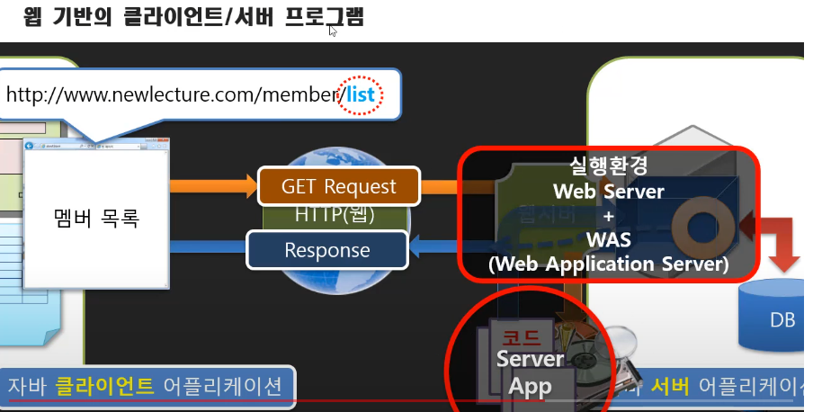
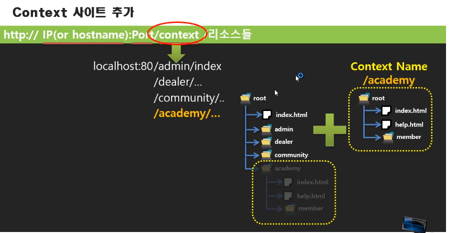
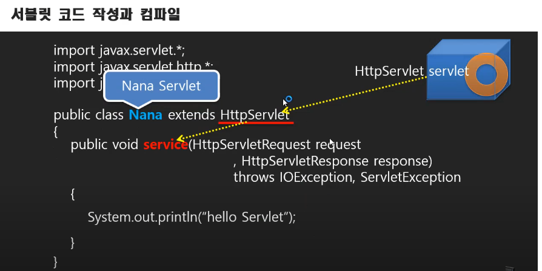

# 서블릿/JSP 강의 01 - 학습 안내
* 자바 Web API = JDK+Servlet+JSP+JDBC
* 자바프로그램에 Sevlet API만 더하면 자바 웹 프로그램이 된다. +문서출력을 위한 JSP
* 공부순서 : 서블릿 -> JSP -> JSP MVC -> Spring MVC

# 서블릿/JSP 강의 02 - 웹 서버 프로그램이란
* 클라이언트+서버 프로그램의 문제가 서버쪽에서 데이터의 변동(예를 들어 열이 하나 추가)이 있을 경우 클라이언트 프로그램도 그에 따른 변동(열 추가)가 필요해서 클라이언트와 동기화하는 작업이 힘들었는데 웹은 브라우저를 통해 그것이 매우용이하게 구현이 돼 있음.-> 기존의 클라이언트+서버 프로그램을 웹 기반으로 변경한 것을 웹 서버 프로그램이라고 한다.
* 기존의 정적 서버(이미 만들어진 문서 전송)에서 동적서버(그 때 그 떄 문서 생성에서 전송)로 변경
* 웹으로 오면서 Client프로그램을 만들지 않음. 웹 기반으로 만듬
* CS프로그램 - Client ,Server 프로그램

# 서블릿/JSP 강의 03 - 웹 서버 프로그램과 Servlet
* 웹 서버의 기본 골격

* Servlet  명칭 이유 : Server Application Let(조각)

# 서블릿/JSP 강의 04 - 톰캣 9 설치하기 #1 of 3
* 톰캣 서버 실행방법 : 톰캣폴더 -> bin폴더 -> startup.bat실행
* 톰캣 install 버전과 zip 버전의 차이 : install 버전은 시작프로그램으로 등록돼 컴퓨터 시작할 때 바로 실행됨 -> 실제 서비스할 때 사용
* 톰캣을 이용하기 위해선 JAVA_HOME 환경변수를 등록해야 한다. -> 톰캣은 JDK를 이용
* 포트번호가 충돌나면 톰캣 실행이 되지 않는다. 

# 서블릿/JSP 강의 05 - 톰캣 9 설치하기 #2 of 3 - 웹문서 추가해보기
* 웹 서버 : 웹 문서를 제공해주는 서비스를 하는 서버
* 톰캣의 홈 디렉토리 : 톰캣폴더 -> wepapps-> ROOT
* 404 error- 해당 문서가 없음

# 서블릿/JSP 강의 06 - 톰캣 9 설치하기 #3 of 3 - Context 사이트 추가하기
* Context 사이트(가상주소) :별개의 사이트인 것처럼 각 부분 구현하는것 , 가상의 경로 설정!

* Context 사이트 만드는법
   1. 별개의 장소에  폴더를 만든다. 
   2. 톰캣폴더 안에 conf폴더로 간다
   3. server.xml을 연다
   4. <Host~>밑에  <Context path="it" docBase="it폴더경로" privileged="true"/>
* server.xml을 수정해 context 설정을 할 경우 서버를 껐다 켜야 돼서 치명적. 

# 서블릿/JSP 강의 07 - 처음으로 서블릿 프로그램 만들어보기
* servlet - 기능별로 코드가 나눠져있고 클라이언트 호출(url)마다  실행 - 조각화 - 조각나 있는 서버 어플리케이션이라 서블릿
* 기본 자바프로그램은 main함수를 시작으로 프로그램을 만들지만 wqs에선 service함수에서 프로그램 시작
* was가 java프로그램 실행시킴 HttpServlet을 상속받는 클래스를 실행 , 그 안의 service의 service함수 구현 및 실행

* Servlet Library는 JDK에 포함되지 않은 lib 
* javac lib포함 실행 옵션 --class-path
* servlet lib 위치 : 톰캣 폴더의 lib폴더

# 서블릿/JSP 강의 08 - 서블릿 객체 생성과 실행 방법
* 자바 클래스파일 위치 -> 톰캣 -> wepapps->ROOT>WEB-INF->clasees     : 여기서 패키지명이 있다면 패키지 깊이 만큼 폴더만들어줘야함
* 톰캣의 루트 디렉토리의 WEB-INF는 사용자가 접근 불가한 비공개영역
* url과 매핑된 Servlet코들르 찾아서 실행. 매핑작업 필요 -> WEB-INF 안의 web.xml에서 설정
