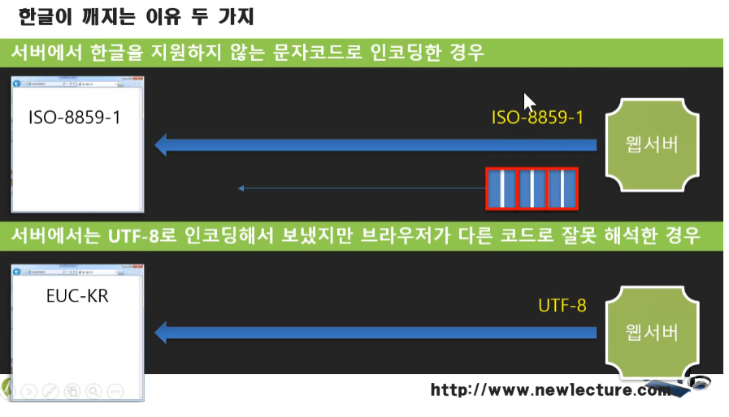
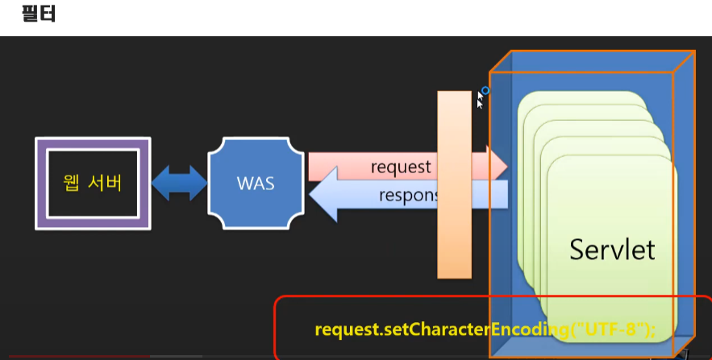

# 서블릿/JSP 강의 09 - 서블릿(Servlet) 문자열 출력
* 기존 자바 프로그램과 서블릿 프로그램에서 달라지는 부분 : 자바  콘솔/웹/윈도우(UI들이 바뀜) 프로그래밍 
* 웹으로 출력스트림 만드는법
```
OutputStream os = response.getOutputStream(); // response객체를 통해 기본 출력 스트림 생성
PrintStream out = new PrintStream(os, true); // print계열 함수들 있는 PrintStream객체 생성, 기본스트림을 인자로 받음
out.println("Hello Servlet!!");
```
* 웹 스트림에서 버퍼의 크기는 8Kbyte로 다 쌓이면 출력, 위에 true인자는 실행단위로 버퍼를 비우라는 약속(Flush)
* 자바 입출력에서 문자를 쓰는데 다국어 - Writer, Reader  영어,숫자- OutputStream,InputStream
* 웹출력에서 기본 Writer객체는 PrintWriter객체?
```
PrintWriter out = response.getWriter(); // PrintWriter객체가 기본인듯? 인자가 아무것도 전달이 안되는걸 보니
out.println("Hello Servlet!!");
```

# 서블릿/JSP 강의 10 - 웹 개발을 위한 이클립스 IDE 준비하기
* 자바 웹 개발 - eclipse enterprise사용
* 코드수정->컴파일->배포->톰캣 서버 재시작->브라우저로 요청 : 이모든게 이클립스에서 해결 가능(Ctrl+F11)
* 프로젝트 : 통합개발환경(이클립스)을 쓰기 위한 정보를 담은 파일, 단위
* Target Runtime으로 WAS 선택

# 서블릿/JSP 강의 10-보충강의 - JSP 프로젝트의 web.xml에서 빨간색 밑줄로 오류가 발생한다면
* servlet 3.0부터는 web.xml을 통해 설정을 변경하는게 아니 annotaion으로 진행.
* 그럼에도 불구하고 web.xml을 eclipse에서 생성하는 법
   1. Dynamic Web Project
   1. Right Click
   1. Java EE Tools
   1. Generate Deployment Descriptor Stub

# 서블릿/JSP 강의 11 - 이클립스를 이용한 서블릿 프로그래밍
* eclipse 실행순서 : 소스파일이 톰캣 디렉토리로 옮겨짐 -> 거기에서 톰캣 실행 -> 브라우저 열림
* eclsipe 프로젝트에서 실행하면 Context로 프로젝트명이 설정됨, 해제법 -> 프로젝트 Propertis->Web Project Settings -> contest root '/'로 설정
* context root 설정 바꿨으면 밑에 server tab에서 context명(프로젝트명으로 돼있음) 삭제

# 서블릿/JSP 강의 12 - 어노테이션을 이용한 URL 매핑
* @WebServlet("/hello") - 메타데이터의 일종
* 어노테이션을 사용하려면 web.xml 의 metadata-complete="false"로 바꿔야함

# 서블릿/JSP 강의 13 - 서블릿 출력 형식을 지정해야 하는 이유
* 출력을 *웹 문서로 인식*을 해서 브라우저마다 출력방식이 다름 - 크롬은 줄빠꿈표시 인식하지만 explorer는 못함 ->내려쓰기 안되는게 정상. 원래는 <br>태그로 줄바꿈
* 브라우저에 컨텐츠 형식을 설정하지 않으면 자의적 해석 text or html

# 서블릿/JSP 강의 14 - 한글과 콘텐츠 형식 출력하기
* 한글이 깨지는 이유 두 가지 

* ISO-8859-1인코딩 방식 : 톰캣 기본설정으로 1byte씩 보냄 브라우저에서도 1byte씩 읽음
* utf-8은 2byte씩 보냄, 브라우저에서 다른 인코딩 방식을 사용하면 다른 언어로 나옴
* 출력할 때 인코딩 방식 지정 : *response.setCharacterEncoding("UTF-8");*
* 개발자 도구 network response header에 인코딩 방식 심어줘야함 -심어주는법 : *response.setContentType("text/html; charset=UTF-8");*

# 서블릿/JSP 강의 15 - GET 요청과 쿼리스트링
* 쿼리스트링 : 문서를 요청할 때 추가적인 옵션
* 쿼리스트링 서블릿에서 받는 코드 : request.getParameter("cnt"); - 문자로 반환
* 상태 500: 서버 내부 오류

# 서블릿/JSP 강의 16 - 기본값 사용하기
* 쿼리스트링 요청 종류
   * /hello?cnt=3  -> "3"
   * /hello?cnt=   ->""
   * /hello?       -> null
   * /hello        -> null 
* 값 확인 절차
```
String cnt_ = request.getParameter("cnt");
int cnt =0; // default value
if(cnt_ != null && !cnt_.equals(""))
		cnt = Integer.parseInt(cnt_);
```

# 서블릿/JSP 강의 17 - 사용자 입력을 통한 GET 요청
* form 안의 태그들의 속성 중 name 이 쿼리로 전달되는 값 이름
* from html 예시(action에 servlet맵핑 주소 적음, name 속성으로 query 스트링 만듬)
```
<form action="hello">
			<div>
				<label>"안녕하세요"를 몇번 듣고 싶으세요?</label>
			</div>
			<div>
				<input type="text" name="cnt"/>
				<input type="submit" value="출력">
			</div>
		</form>
```
* eclipse 에서 새 파일 만들 때 인코딩 방식 설정법 : windows 탭 -> preference -> web탭 -> html,jsp,css 인코딩 방식 변경

# 서블릿/JSP 강의 18 - 입력할 내용이 많은 경우는 POST 요청
* get 요청의 문제 : url길이의 제한(장문의 내용은 쿼리스트링으로 주는게 아님)
* post는 요청 바디에 붙어서 전달됨
* get으로 보낼 땐 한글이 괜찮았는데 post로 보내면 한글이 깨지는 문제발생 -> 한글이 전달되는 것을 서버에서 받지 못하는 문제임

# 서블릿/JSP 강의 19 - 한글 입력 문제
* 톰캣의 기본 인코딩 방식은 ISO-8859-1
* request.setCharacteEncoding("UTF-8");로 변경해야함
* 혹은 서버 절정 server.xml의 Connector의 encoding방식을 변경 -> 톰캣 서버 자체 설정 건드리는건 비추천, 여러 서비스를 톰캣 서버 하나에서 운영하기 때문에

# 서블릿/JSP 강의 20 - 서블릿 필터(Servlet Filter)

* was가 요청에 맞는 servlet 실행
* servlet container : 실행한 servlet이 메모리에 존재하는 공간
* Servlet filer : was가 요청을 받아서 servlet을 실행하기 전에 실행돼서 조건에 맞게 필터링 진행, 수문장 역할을 하면서 모든 서블릿에 동이란 설정을 부여하는 기능도 할 수 있다. 또한 필터는 request, response 각각 실행됨

* 필터는 톰캣이 처음 실행될 때도 한번 실행된다.
* 필터 만드는 법
   1. Filter 클래스 생성
   ```
   package com.newlecture.web.filter;

	import java.io.IOException;

	import javax.servlet.Filter;
	import javax.servlet.FilterChain;
	import javax.servlet.ServletException;
	import javax.servlet.ServletRequest;
	import javax.servlet.ServletResponse;
	
	@
	public class CharacterEncodingFilter implements Filter {

		@Override
		public void doFilter(ServletRequest resquest
				, ServletResponse response
				, FilterChain chain)
				throws IOException, ServletException {
			
			System.out.println("before  filter");
			chain.doFilter(request,response); //흐름을 다음 필터 혹은 서블릿으로 넘기는 것 ->서블릿 실행
			System.out.println("after  filter");
		}

	}

   ```
   2. web.xml 설정
   ```
   <filter>
  	<filter-name>characterEncodingFilter</filter-name>
  	<filter-class>com.newlecture.web.filter.CharacterEncodingFilter</filter-class>  -- 필터 클래스 이름(패키지명 포함)
  </filter>
  <filter-mapping>
  	<filter-name>characterEncodingFilter</filter-name>
  	<url-pattern>/*</url-pattern>   --모든 url요청에 대해서 필터 실행
  </filter-mapping>
   ```
   3. annotation 설정 :@WebFilter("/*")

# 서블릿/JSP 강의 21 - 학습과제(사용자 입력을 통한 계산 요청)

# 서블릿/JSP 강의 22 - 과제풀이(사용자 입력을 통한 계산 요청)

# 
