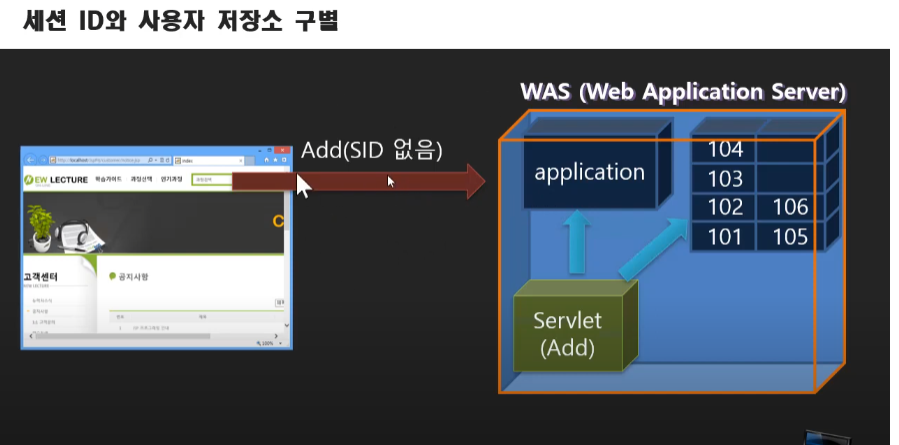
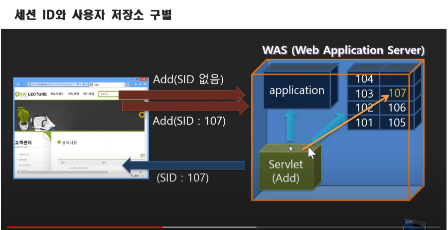
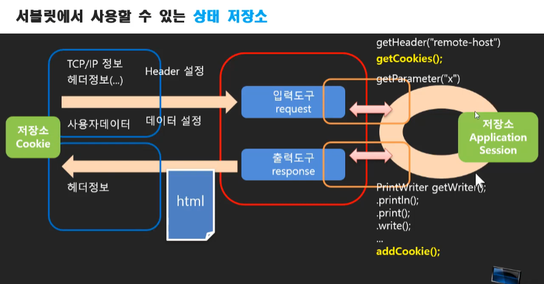

# 서블릿/JSP 강의 23 - 여러 개의 Submit 버튼 사용하기
* 제출양식이 여러 종류일 경우 submit 속성 중 name의 이름을 설정하면 (submit버튼 모두 동일한 name값 가져야 한다.) 서버로 name=value값이 전달된다.

# 서블릿/JSP 강의 24 - 입력 데이터 배열로 받기
* name 속성을 같은 이름으로 전달하면 servlet에서 getParmeterValues 함수 사용 ->배열로 넘어옴
* for 문 안의 선언문은 연산이 아니기 때문에 반복 전에 한번 볍수 선언 후 다시 실행되지 않는다.

# 서블릿/JSP 강의 25 - 상태 유지를 필요로 하는 경우와 구현의 어려움
* 전역변수가 필요한데 전역변수같은 개념을 갖고있지 않은 조각나있는 어플리케이션 - 서블릿 -> 서블릿들 사이에서 값 유지의 필요성
* 상태 유지를 위한 5가지 방법
   * application
   * session
   * cookie
   * hidden input
   * querystring

# 서블릿/JSP 강의 26 - Application 객체와 그것을 사용한 상태 값 저장
* 각 서블릿은 요청이 들어오면 실행됐다가 바로 메모리에서 사라진다.
* 서블릿 context(application저장소) : 모든 서블릿이 공유하는 데이터 저장소, 상태 저장공간
```
ServletContext application = request.getServletContext();
application.getAttribute(''); -> Object 타입으로 반환
application.setAttribute('',);
```

# 서블릿/JSP 강의 27 - Session 객체로 상태 값 저장하기(그리고 Application 객체와의 차이점)
* Session 데이터의 사용 - 같은 세션에서 유지하는 데이터
```
HttpSession session = request.getSession();
session.getAttribute(''); -> Object 타입으로 반환
session.setAttribute('',);
```
* 세션 : 현재 접속을 의미, 사용자 구분하는 단위
* 브라우저마다 세션이 다르다. 동일 브라우져라면 동일 세션이다 -> 요즘은 개별 프로세스가 아닌 스레드를 이용하기 때문

# 서블릿/JSP 강의 28 - WAS가 현재사용자(Session)을 구분하는 방식
* 브라우저의 첫 요청 -세션공간 사용 불가

* 첫 접속 후 WAS에게 세션ID부여받음 - 세션공간에 데이터 조작 가능

* 세션 아이디로 사용자 구분 - 개발자도구의 네트워크에서 확인가능, Headers에 
* 세션 공간은 세션ID접속자가 접속을 안하면 일정 시간 후 WAS에 의해 사라짐
* 세션 메소드
   1. void setAttribute(String name, Object value) : 지정된 이름으로 객체를 설정
   2. Object getAttributes(String name) : 지정한 이름의 객체를 반환
   3. void invalidate() : 세션에서 사용되는 객체들을 바로 해제
   4. void setMaxInactiveInterval(int interval) : 세션 타임아웃을 정수(초)로 설정 - 기본30분
   5. boolean isNew() : 세션이 새로 생성되었는지를 확인
   6. Long getCreationTime() : 세션이 시작된 시간을 반환, 1970년 1월 1일을 시작으로 하는 밀리초
   7. long getLastAccessedTime() : 마지막 요청 시간, 1970년 1월 1일을 시작으로 하는 밀리초 

# 서블릿/JSP 강의 29 - Cookie를 이용해 상태값 유지하기
* Cookie 브라우저 측에서 데이터를 저장하는 기술
* Header - 브라우저에서 보내주는 데이터, 쿠키도 header에 담겨서 전달
* 서블릿에서 사용할 수 있는 상태 저장소

* 쿠키 저장하기
```
Cookie cookie = new Cookie("c", String.valueOf(result));
response.addCookie(cookie);
```
* 쿠키 읽기/쿠키는 배열로 온다.
```
Cookie[] cookies = request.getCookies();
String c_="";

if(cookies !=null)
  for(Cookie cookie : cookies)
    if("c".equals(cookie.getName()))
      c_ = cookie.getValue();
```

# 서블릿/JSP 강의 30 - Cookie의 path 옵션
*  Cookie의 path 옵션 : 자신 혹은 일정 범주의 경로를 들어올 때 이 쿠키를 들고 오게 설정하는 것, request기준!
*  path 범주 설정하려면 /Calc/   - 이런식으로 Calc안의 모든 경로 설정 가능
```
쿠키객체이름.setPath("/")  //모든 경로로 들어올 때 이 쿠키 들고감
```
